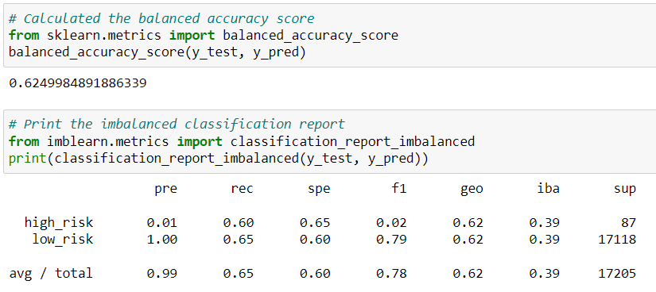
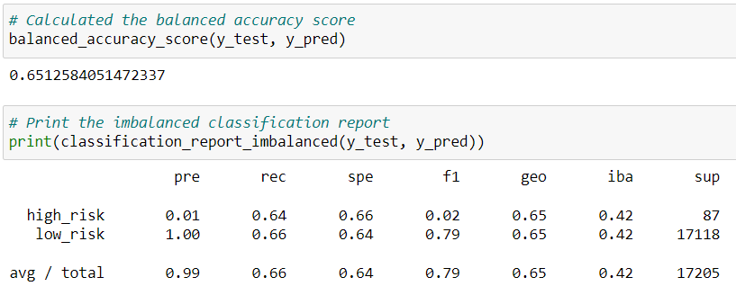
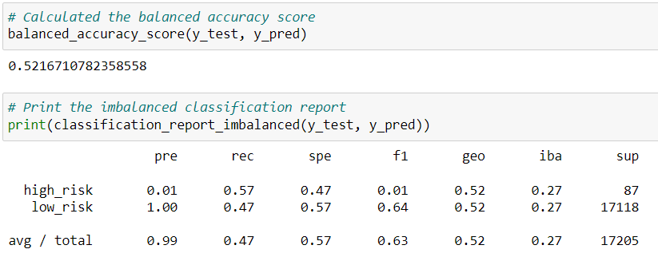
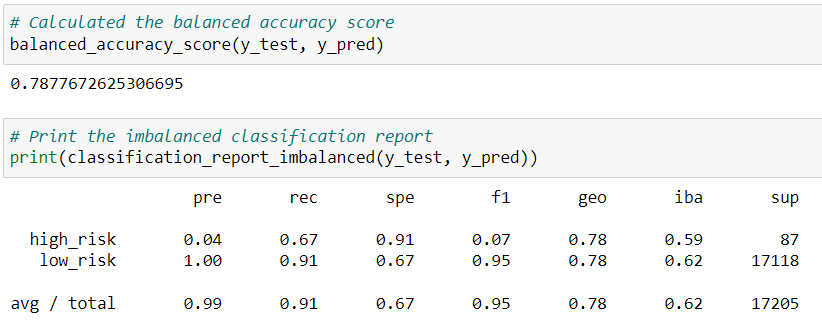
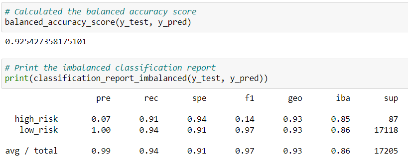

# Credit Risk Analysis
*Supervised Machine Learning*

## Project Overview
For this project, I am utilizing several models of **supervised machine learning** on credit loan data in order to predict credit risk. Credit risk is an inherently unbalanced classification problem, as good loans easily outnumber risky loans. I will be using Python and **Scikit-learn libraries** and several machine learning models to compare the strengths and weaknesses of **Machine Learning models** and determine how well a model classifies and predicts data. 

## Resources
- Data Source: LoanStats_2019Q1.csv (file not uploaded to GitHub because of its size)
- Software: **Jupyter Notebook**
- Languages: **Python**
- Libraries: **Scikit-learn**
- Environment: **Python 3.7**

## Results
In this analysis I used six different algorithms of **supervised machine learning**. First four algorithms are based on **resampling techniques** and are designed to deal with **class imbalance**. After the data is resampled, Logistic Regression is used to predict the outcome. The last two models are ensemble learners. The concept of ensemble learning is the process of combining multiple models, like decision tree algorithms, to help improve the accuracy and robustness, as well as decrease variance of the model, and therefore increase the overall performance of the model.

### 1. Naive Random Oversampling and Logistic Regression
In random oversampling, instances of the minority class are randomly selected and added to the training set until the majority and minority classes are balanced.

- **Accuracy score:** 0.62
- **Precision**
    - For high risk: 0.01
    - For low risk: 1.00
- **Recall**
    - For high risk: 0.60
    - For low risk: 0.65

<i>Figure 1: Results for Naive Random Oversampling.</i>

### 2. SMOTE Oversampling and Logistic Regression
The synthetic minority oversampling technique (SMOTE) is another oversampling approach where the minority class is increased. Unlike other oversampling methods, SMOTE interpolates new instances, that is, for an instance from the minority class, a number of its closest neighbors is chosen. Based on the values of these neighbors, new values are created.

- **Accuracy score:** 0.65
- **Precision**
    - For high risk: 0.01
    - For low risk: 1.00
- **Recall**
    - For high risk: 0.64
    - For low risk: 0.66

<i>Figure 2: Results for SMOTE Oversampling.</i>

### 3. Cluster Centroids Undersampling and Logistic Regression
Undersampling takes the opposite approach of oversampling. Instead of increasing the number of the minority class, the size of the majority class is decreased.

- **Accuracy score:** 0.52
- **Precision**
    - For high risk: 0.01
    - For low risk: 1.00
- **Recall**
    - For high risk: 0.57
    - For low risk: 0.47

<i>Figure 3: Results for ClusterCentroids Undersampling.</i>

### 4. SMOTEENN (Combination of Over and Under Sampling) and Logistic Regression
SMOTEENN is an approach to resampling that combines aspects of both oversampling and undersampling - oversample the minority class with SMOTE and clean the resulting data with an undersampling strategy (5). 

- **Accuracy score:** 0.65
- **Precision**
    - For high risk: 0.01
    - For low risk: 1.00
- **Recall**
    - For high risk: 0.72
    - For low risk: 0.58

<i>Figure 4: Results for SMOTTEENN Model.</i>

### 5. Balanced Random Forest Classifier
Instead of having a single, complex tree like the ones created by decision trees, a random forest algorithm will sample the data and build several smaller, simpler decision trees. Each tree is simpler because it is built from a random subset of features.

- **Accuracy score:** 0.79
- **Precision**
    - For high risk: 0.04
    - For low risk: 1.00
- **Recall**
    - For high risk: 0.67
    - For low risk: 0.91

<i>Figure 5: Results for Balanced Random Forest Classifier Model.</i>

### 6. Easy Ensemble AdaBoost Classifier
In AdaBoost Classifier, a model is trained then evaluated. After evaluating the errors of the first model, another model is trained. The model gives extra weight to the errors from the previous model. The purpose of this weighting is to minimize similar errors in subsequent models. This process is repeated until the error rate is minimized.

- **Accuracy score:** 0.93
- **Precision**
    - For high risk: 0.07
    - For low risk: 1.00
- **Recall**
    - For high risk: 0.91
    - For low risk: 0.94

<i>Figure 6: Results for Easy Ensemble AdaBoost Classifier Model.</i>

## Summary

From the results section above we can see how different ML models work on the same data. I would like to start the interpretation of the results with a brief explanation of the outcomes.

:round_pushpin: **Accuracy score**  tells us what percentage of predictions the model gets it right. However, it is not enough just to see that results, especially with unbalanced data. *Equation: accuracy score = number of correct prediction / total number of predictions*

:round_pushpin: **Precision** is the measure of how reliable a positive classification is. A low precision is indicative of a large number of false positives. *Equation: Precision = TP/(TP + FP)*

:round_pushpin: **Recall** is the ability of the classifier to find all the positive samples. A low recall is indicative of a large number of false negatives. *Equation: Recall = TP/(TP + FN)*

:round_pushpin: **F1 Score** is a weighted average of the true positive rate (recall) and precision, where the best score is 1.0 and the worst is 0.0 (3). *Equation: F1 score = 2(Precision * Sensitivity)/(Precision + Sensitivity)*

### Results summary

**First 4 models – resampling and logistic regression**

From the results above we can see that first four models don’t do well based off the **accuracy scores**. Those scores are 0.62, 0.65, 0.52 and 0.65 for Naive Random Oversampling, SMOTE Oversampling, Cluster Centroids Undersampling and SMOTEENN model respectively, meaning the models were accurate roughly a bit more than half of the time. 
**Precision** for all four models is 0.01 for high risk loan and 1.00 for low risk loans. **Low precision score** for high risk loans is due to large number of false positives, meaning that too many of low risk loans were marked as high risk loans. High score for low risk loans indicate that nearly all low risk scores were marked correctly; however, lower **recall score** (0.62 for naive Naive Random Oversampling and Logistic Regression, for example) indicates that there were quite a few low risk loans that were market as high risk, when they actually weren’t. Actual high risk loans have slightly better scores on recall (0.60 for naive Naive Random Oversampling and Logistic Regression, for example) meaning that there weren’t as many false negatives or not too many high risk loans were marked as low risk loans. 

**Last 2 models – ensemble models**

Other two models did better. Their **accuracy scores** are 0.79 and 0.93 for Balanced Random Forest Classifier and Easy Ensemble AdaBoost Classifier respectively. **Recall scores** for both model and both – low and high risk scores and precision for low risk were high, meaning very good accuracy. **Precision** for high risk loans in both models weren’t high. 0.04 and 0.07 for Balanced Random Forest Classifier and Easy Ensemble AdaBoost Classifier respectively, indicating that there were **large number of false positives**, meaning that large number of low risk loans were marked as high risk.

### Recommendation on the model

Since first three models didn’t do well on the test, I wouldn’t use them in the real-word testing without further fine-tuning, for example train model on larger dataset, or look through the columns that were use for training the model. 
Other two models showed better results, yet I would use them with caution, since they might be prone to overfitting. If that occurs and we don’t get desired results when working with new data set, we can do some further fine-tunning (pruning) to avoid the overfitting.
